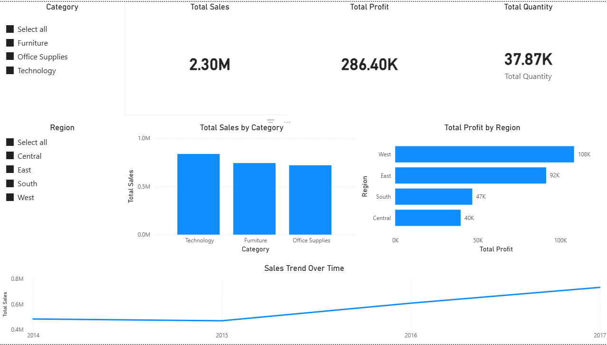

# Superstore Sales Analysis

## Objective
Analyze sales, profit, quantity, category-wise performance, and regional trends using Excel, SQL, and Power BI.

## Tools Used
- Excel
- SQL
- Power BI

## Features
- Sales Analysis
- Profit Analysis
- KPI Dashboard
- Regional Insights
- Category-wise Analysis
- Interactive Filters

## Dashboard Insights
- Total Sales: 2.30M
- Total Profit: 286.40K
- Total Quantity: 37.87K
- Technology category achieved highest sales.
- West region generated highest profit.

## Project Components
- Excel Analysis
- SQL Queries
- Power BI Dashboard

## Dashboard Preview

